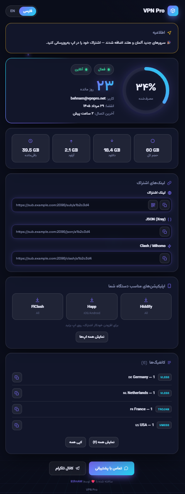

# 3x-ui 3D Subscription Template

A modern, self-contained subscription page template for [3x-ui](https://github.com/MHSanaei/3x-ui) — glassmorphism cards, 3D tilt, animated 3D background, circular usage gauge, QR code, one-tap app import, and full **Persian (فارسی) / English** support with RTL/LTR switching.



## Features

- 🌐 FA / EN toggle (saved in the browser), automatic RTL/LTR
- 🌓 Auto dark / light theme (follows the device)
- 🧊 3D floating background scene + mouse-tilt cards (pure CSS/JS, no libraries)
- 📊 Circular usage gauge, days-remaining countdown, upload/download/total/remaining stats
- 📅 Jalali (شمسی) dates in Persian mode, Gregorian in English
- 🔗 Copy buttons for subscription / JSON / Clash links + QR code (generator embedded — works offline/with blocked CDNs)
- 📱 One-tap import: v2rayNG, Hiddify, Streisand, Shadowrocket, Happ, FlClash (editable list)
- 🟢 Live online/offline status badge — auto-refreshes every 30s via the panel's `?format=info` endpoint (v3.6.0+)
- 📢 Announcement banner, support button, per-config list with copy
- 📦 Single `index.html` file — no assets, no build step

## Install

> **Requires 3x-ui v3.3.0+** — custom subscription templates were added in [v3.3.0](https://github.com/MHSanaei/3x-ui/releases/tag/v3.3.0).
> **Verified against [v3.6.0](https://github.com/MHSanaei/3x-ui/releases/tag/v3.6.0)**: that release rebuilt the default subscription page as a React SPA, but custom themes still take precedence over it and the [template variables](https://github.com/MHSanaei/3x-ui/blob/main/docs/custom-subscription-templates.md) are unchanged.

The template targets the newest panel and degrades cleanly on older ones — unavailable variables render empty rather than erroring, so nothing breaks:

| Panel | Result |
|---|---|
| **v3.6.0+** | Everything, including the live online/offline badge (`{{ .isOnline }}` + `?format=info`) |
| **v3.5.x** | No live badge — status shows "offline". Announcement banner works. |
| **v3.3.0 – v3.4.x** | No live badge, no announcement banner (`{{ .announce }}` arrived in v3.5.0) |
| **< v3.3.0** | Not supported — no custom template feature at all |

**One-liner** — paste this on your server (replace the URL if you forked the repo):

```bash
sudo mkdir -p /etc/3x-ui/sub_templates/my-theme && sudo curl -fsSL https://raw.githubusercontent.com/B3hnamR/3x-ui-sub-template/main/index.html -o /etc/3x-ui/sub_templates/my-theme/index.html && sudo chmod 755 /etc/3x-ui/sub_templates /etc/3x-ui/sub_templates/my-theme && sudo chmod 644 /etc/3x-ui/sub_templates/my-theme/index.html
```

**Or use the interactive setup script** — detects your 3x-ui installation and version, asks for your brand name, Telegram channel, support link, and language, then installs and backs up any existing template automatically:

```bash
bash <(curl -fsSL https://raw.githubusercontent.com/B3hnamR/3x-ui-sub-template/main/install.sh)
```

The script asks a few questions, downloads the template, fills in your answers, backs up any existing `index.html` in the theme folder, and installs. It also moves aside a stray `sub.html` if it finds one, since the panel loads that in preference to `index.html`. Run it again anytime to reconfigure — it always backs up before replacing.

Then in the panel: **Settings → Subscription → Profile → Sub Theme Directory**

> On v3.5.0 and older that tab is labelled **Information** instead of **Profile** — same field.

```
/etc/3x-ui/sub_templates/my-theme/
```

Save and restart the panel, then open your sub link in a browser:

```
https://your-domain:2096/sub/SUB_ID
```

Any browser gets the page automatically (the panel detects `Accept: text/html`). Append `?html=1` to force it from tools like `curl`:

```
curl 'https://your-domain:2096/sub/SUB_ID?html=1'
```

> If the theme folder also contains a `sub.html`, the panel loads **that** instead of `index.html` — delete it if you installed with the one-liner above. The panel re-reads the file whenever its modification time changes, so edits show up without a restart.

## Customize

Everything lives at the top of `index.html`:

- **`CONFIG`** (in the first `<script>`): brand name, Telegram channel, support-link fallback, default language, and the app deep-link list (with per-OS visibility). Placeholders like `YOUR_BRAND_NAME` / `YOUR_CHANNEL` — just replace them.
- **`EDIT ME` CSS block**: `--accent`, `--accent-2` and status colors.

The brand name is only used when the panel's *Sub Title* is empty — set the title in the panel and it takes over automatically.

## 💖 Support the project

If this template has been useful to you, donations help fund ongoing development, testing, and maintenance.

| Asset / network | Donation address |
|---|---|
| TRON | `TVEKp9cAU97PGfvWse7BxseeiwfCVyRef4` |
| USDT - TRC20 | `TVEKp9cAU97PGfvWse7BxseeiwfCVyRef4` |
| USDT - BEP20 | `0x34E90a9476028F15064EE8fa6aa7c1b4dDE3f480` |
| TON | `UQAuXUNyd4Sfvhm59Ef27UNC46oEBrVys5Ud7VLzqZOj5O13` |

> ⚠️ **Important:** Please verify both the asset and network before sending. Blockchain transfers are irreversible.
